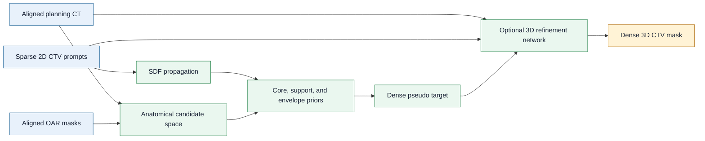

# CTV Sparse-Prompt Refinement

[](https://github.com/Huangyanxin-China/CTV-SparsePrompt-Refine/actions/workflows/pages.yml)
[](requirements.txt)
[](docs/privacy_release_checklist.md)


Public research implementation of a sparse-prompt clinical target volume (CTV)
completion and refinement workflow. The repository provides data-agnostic
preprocessing, optional 3D refinement, evaluation utilities, and a visual
project page. Reversible medical volumes, identifying metadata, model
checkpoints, and private study descriptions are not included.

**[Project page](https://huangyanxin-china.github.io/CTV-SparsePrompt-Refine/)** |
**[Complete slice viewer](https://huangyanxin-china.github.io/CTV-SparsePrompt-Refine/real-results/single-case-complete-slices.html)** |
**[Scripts guide](scripts/README.md)** |
**[Privacy checklist](docs/privacy_release_checklist.md)**

> **Research use only:** This code and its visual examples are not a medical
> device and are not intended for clinical decision-making.

<p align="center">
  
</p>

<p align="center"><em>Dynamic method comparison rendered from de-identified 2D CT crops. No source volume, identifier, acquisition date, or local path is embedded.</em></p>

## Overview

Sparse 2D target prompts provide strong local information but do not directly
define a complete 3D target. This project propagates those prompts with signed
distance fields (SDFs), constructs anatomy-constrained core, support, and
envelope priors, and optionally trains a compact 3D network to refine the dense
pseudo target.

| Component | Purpose |
| --- | --- |
| Sparse-prompt propagation | Convert selected 2D target masks into a dense 3D SDF prior |
| Candidate construction | Build core, support, and envelope regions for auditable completion |
| Anatomy constraints | Restrict candidate regions using aligned organ-at-risk masks |
| Optional refinement | Learn a pseudo-to-target correction from CT and geometric priors |
| Evaluation | Report overlap and surface metrics from folder-level predictions |

The public package contains method code and rendered demonstrations. It does
not contain a dataset, pretrained weights, or private experiment records.

## Results preview

<p align="center">
  
</p>

<p align="center"><em>Static multi-method comparison using the same ROI for every method. Colors distinguish the expert reference from each prediction.</em></p>

<details>
<summary>Open the complete target-range slice animation</summary>

<p align="center">
  
</p>

The corresponding interactive gallery is available in the
[complete slice viewer](https://huangyanxin-china.github.io/CTV-SparsePrompt-Refine/real-results/single-case-complete-slices.html).

</details>

---

The visual assets are pre-rendered, de-identified 2D crops. They are included
for qualitative inspection only and cannot be used to reconstruct the source
medical volumes.

## Method



The preprocessing stage is usable without the refinement network. The network
stage consumes the generated pseudo target and geometric channels, then writes
checkpoints, validation summaries, and test-set predictions to the selected
output directory.

## Installation

### Requirements

| Item | Requirement |
| --- | --- |
| Python | 3.10 or newer |
| Core packages | NumPy, SciPy, SimpleITK, NiBabel, PyTorch, Pillow, Matplotlib, MedPy |
| GPU | Optional for preprocessing; recommended for network training |
| Input format | Volumes readable by SimpleITK, commonly NIfTI |

The dependency file is intentionally lightweight and does not pin a CUDA
build. Install the PyTorch build appropriate for your system when GPU training
is required.

### Setup

```bash
git clone https://github.com/Huangyanxin-China/CTV-SparsePrompt-Refine.git
cd CTV-SparsePrompt-Refine

conda create -n ctv-sparse-refine python=3.10 -y
conda activate ctv-sparse-refine
python -m pip install --upgrade pip
python -m pip install -r requirements.txt
```

Verify the core environment:

```bash
python -c "import SimpleITK, nibabel, numpy, scipy, torch; print('environment ready')"
```

An optional SAM-Med3D adapter is included, but third-party source code and
checkpoints are not bundled. Configure local installations only when needed:

```bash
export SAM_MED3D_ROOT=/path/to/SAM-Med3D
export SAM_MED3D_CKPT=/path/to/checkpoint.pth
```

## Data interface

All inputs must be supplied locally. CT, target labels, sparse prompts, and OAR
masks belonging to the same sample must share the same array geometry and
physical coordinate system.

```text
/path/to/local_target_data/
  imagesTr/
  labelsTr/
  imagesTs/
  labelsTs/

/path/to/local_oar_data/
  labelsTr/
  labelsTs/
```

Keep these directories outside the repository. The committed `.gitignore`
excludes common medical-image volumes, model artifacts, predictions, logs, and
generated result folders.

## Quick start

Inspect the available options before running a workflow:

```bash
python scripts/run_sparse_prompt_core_envelope_workflow.py --help
python scripts/run_k7_preprocess_variant_screen.py --help
python scripts/train_ctv_pseudo_refine_net.py --help
python scripts/evaluate_segmentation_folder.py --help
```

### Sparse-prompt preprocessing

Run the SDF and core-envelope workflow across several prompt budgets:

```bash
python scripts/run_sparse_prompt_core_envelope_workflow.py \
  --ct_dir /path/to/local_target_data/imagesTs \
  --gt_dir /path/to/local_target_data/labelsTs \
  --oar_dir /path/to/local_oar_data/labelsTs \
  --out_root results/sparse_prompt_workflow \
  --k_values 3 5 7
```

Screen the K=7 preprocessing variants:

```bash
python scripts/run_k7_preprocess_variant_screen.py \
  --train_label_dir /path/to/local_target_data/labelsTr \
  --test_label_dir /path/to/local_target_data/labelsTs \
  --out_dir results/k7_screen
```

### Training and test inference

Generate pseudo targets and train the refinement network in one command:

```bash
python scripts/train_ctv_pseudo_refine_net.py \
  --source /path/to/local_target_data \
  --oar_source /path/to/local_oar_data \
  --feature_source generate \
  --out_dir results/refinement_run \
  --max_epochs 80
```

On completion, the command writes the selected checkpoint under
`results/refinement_run/checkpoints/` and test predictions under
`results/refinement_run/predictions_test/`. Add `--amp` for mixed-precision
CUDA training. The current public release combines training and test inference;
it does not provide a separate checkpoint-only inference entry point.

### Evaluation

Evaluate a prediction folder with explicit class labels:

```bash
python scripts/evaluate_segmentation_folder.py \
  --gt_dir /path/to/local_target_data/labelsTs \
  --pred_dir results/refinement_run/predictions_test \
  --classes 1 \
  --class_names CTV \
  --output_csv results/evaluation/per_sample.csv \
  --output_json results/evaluation/summary.json
```

Additional preprocessing, baseline, and evaluation commands are documented in
the [scripts guide](scripts/README.md).

## Visualization

Preview the same static site deployed by GitHub Pages:

```bash
python -m http.server 8000 --directory site
```

Open `http://localhost:8000` in a browser. The site includes the dynamic
workflow comparison, the static multi-method panel, and the complete slice
viewer. Source medical volumes and the private rendering pipeline are not part
of the public package.

Pushes to `main` deploy `site/` through
[the Pages workflow](.github/workflows/pages.yml).

## Repository structure

| Path | Contents |
| --- | --- |
| `models/` | 3D network modules and the optional SAM-Med3D adapter |
| `scripts/` | Data-agnostic preprocessing, training, evaluation, and summary entry points |
| `utils/` | Volume IO, geometry, connectivity, and metric helpers |
| `site/` | Static GitHub Pages project site and de-identified rendered assets |
| `docs/` | Public release and privacy checks |
| `.github/workflows/pages.yml` | GitHub Pages deployment workflow |

## Privacy and release policy

The repository may include de-identified rendered 2D CT crops with contour
overlays. It must not include reversible medical volumes, DICOM or NIfTI data,
sample identifiers, dates, institutions, private paths, checkpoints, or
dataset-level descriptions. Review
[`docs/privacy_release_checklist.md`](docs/privacy_release_checklist.md) before
every public release.

## Citation

No archival paper or DOI is bundled with this release. Until a formal citation
record is published, cite the repository and the exact commit used:

```bibtex
@software{ctv_sparse_prompt_refinement,
  author  = {Huangyanxin-China},
  title   = {CTV Sparse-Prompt Refinement},
  year    = {2026},
  url     = {https://github.com/Huangyanxin-China/CTV-SparsePrompt-Refine},
  note    = {Specify the accessed Git commit}
}
```

## License

This repository does not currently include an open-source license. Unless a
license file is added, the source is publicly viewable but no permission is
granted to copy, modify, or redistribute it. Contact the repository owner
before reuse.
