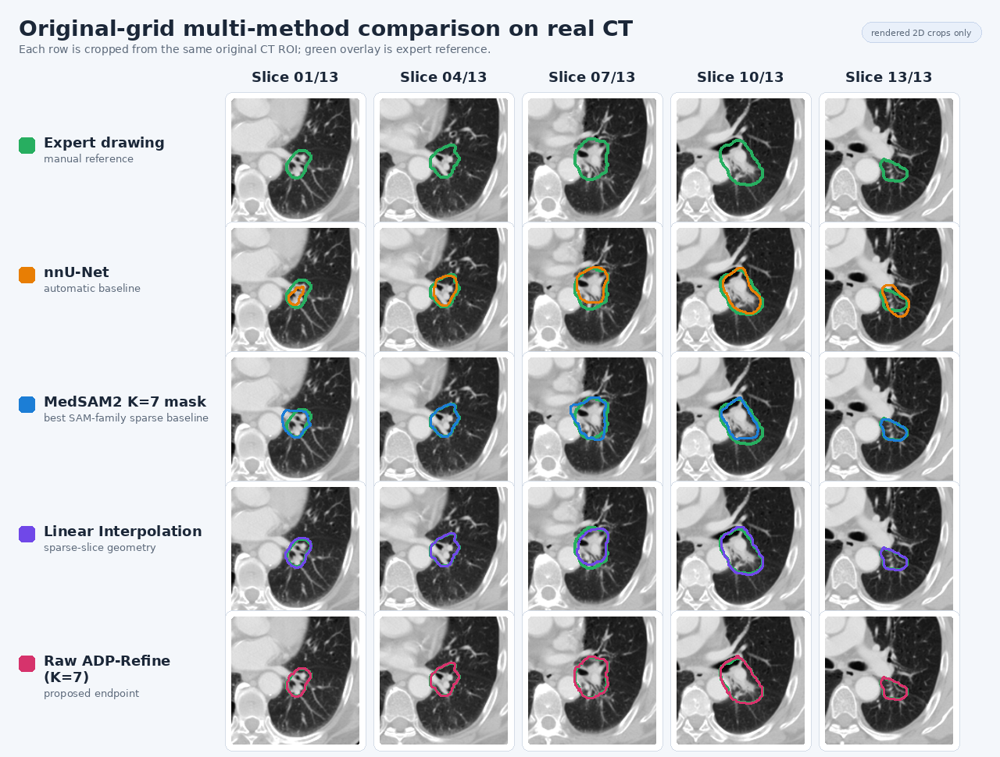
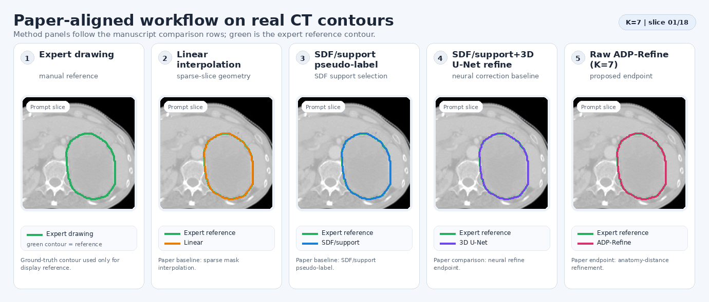

# CTV Sparse-Prompt Refinement

[](https://huangyanxin-china.github.io/CTV-SparsePrompt-Refine/)
[](docs/privacy_release_checklist.md)
[](requirements.txt)

Public implementation of a sparse-prompt clinical target volume (CTV)
refinement workflow. The repository provides method code, de-identified real
CT-and-contour result visualizations, environment requirements, and command
templates. Raw clinical volumes, label volumes, model checkpoints, case
identifiers, and study-level dataset details are not included.

## Real CT And Contour Result Preview

<p align="center">
  <strong>Dynamic single-case slice display</strong><br>
  
</p>

<p align="center">
  <strong>Static multi-method comparison</strong><br>
  
</p>

<p align="center">
  <strong>Dynamic workflow display</strong><br>
  
</p>

The repository homepage shows the three public result views directly. These
assets are rendered 2D CT crops with contour overlays from one de-identified
case. Original DICOM/NIfTI volumes, case identifiers, acquisition dates, local
paths, and scan metadata are not included.

The workflow and multi-method comparison are rendered from original CT-grid
outputs after applying the same ROI crop. They show Expert drawing, nnU-Net,
MedSAM2 K=7 mask, Linear Interpolation, and Raw ADP-Refine (K=7).

- Single-case complete slice display:
  [`site/real-results/single-case-complete-slices.html`](site/real-results/single-case-complete-slices.html)
- Static multi-method comparison:
  [`site/assets/real_ct_multi_method_comparison.png`](site/assets/real_ct_multi_method_comparison.png)
- Dynamic workflow display:
  [`site/assets/real_ct_workflow_demo.gif`](site/assets/real_ct_workflow_demo.gif)

When GitHub Pages is enabled, the rendered project page is available at:

```text
https://huangyanxin-china.github.io/CTV-SparsePrompt-Refine/
```

## What This Repository Contains

- SDF propagation from sparse 2D target prompts.
- Core-envelope candidate construction for auditable 3D target completion.
- Support-intersection preprocessing and K-value screening utilities.
- A lightweight pseudo-to-true 3D refinement network.
- Generic evaluation utilities for overlap and surface metrics.
- A static GitHub Pages homepage with de-identified real CT crops, expert
  drawings, and method contour overlays.

## Data Privacy Boundary

This public package intentionally excludes private raw data, reversible medical
volumes, generated prediction volumes, and identifying metadata. You will need
to supply your own local data paths when running the scripts. Do not commit
local data, generated predictions, checkpoints, logs, or institutional
metadata.

The public display assets are de-identified PNG/GIF/HTML renderings derived
from 2D CT crops and segmentation contours. They omit original DICOM/NIfTI
volumes, local case names, acquisition dates, private paths, and clinical
metadata.

## Visual Result Pages

- `site/index.html`: public homepage with workflow, setup, privacy boundary, and
  result-display sections.
- `site/real-results/single-case-complete-slices.html`: complete target-range
  axial slice gallery rendered from de-identified real CT crops and contours.
- `site/assets/real_ct_single_case_slices.gif`: dynamic single-case CT slice
  display with expert drawing and sparse-prompt refinement contours.
- `site/assets/real_ct_multi_method_comparison.png`: static original-grid ROI
  comparison of expert drawing, nnU-Net, MedSAM2 K=7 mask, Linear
  Interpolation, and Raw ADP-Refine (K=7).
- `site/assets/real_ct_workflow_demo.gif`: dynamic workflow display on real CT
  crops using the same original-grid ROI crop and method labels.

## Environment

Recommended base environment:

```bash
conda create -n ctv-sparse-refine python=3.10 -y
conda activate ctv-sparse-refine
pip install -r requirements.txt
```

Core dependencies are listed in `requirements.txt`:

```text
numpy
scipy
SimpleITK
nibabel
torch
Pillow
matplotlib
python-pptx
python-docx
medpy
```

GPU acceleration is optional for preprocessing and useful for training the
refinement network. The code does not download data or checkpoints by default.

## Expected Local Data Layout

The scripts accept explicit local paths. A typical nnU-Net-style layout is:

```text
/path/to/local_dataset/
  imagesTr/
  labelsTr/
  imagesTs/
  labelsTs/

/path/to/local_oar_dataset/
  labelsTr/
  labelsTs/
```

Images are expected as medical volumes readable by SimpleITK, commonly
`*.nii.gz`. Local paths and files should stay outside Git tracking.

## Quick Start

Inspect command-line options:

```bash
python scripts/run_sparse_prompt_core_envelope_workflow.py --help
python scripts/run_k7_preprocess_variant_screen.py --help
python scripts/train_ctv_pseudo_refine_net.py --help
```

Run sparse-prompt core-envelope screening:

```bash
python scripts/run_sparse_prompt_core_envelope_workflow.py \
  --ct_dir /path/to/local_dataset/imagesTs \
  --gt_dir /path/to/local_dataset/labelsTs \
  --oar_dir /path/to/local_oar_dataset/labelsTs \
  --out_root results/demo_sparse_prompt_workflow \
  --k_values 3 5 7
```

Run K=7 preprocessing selection:

```bash
python scripts/run_k7_preprocess_variant_screen.py \
  --train_label_dir /path/to/local_dataset/labelsTr \
  --test_label_dir /path/to/local_dataset/labelsTs \
  --out_dir results/demo_k7_screen
```

Run a traditional sparse-slice interpolation baseline:

```bash
python scripts/run_traditional_linear_mask_interpolation_baseline.py \
  --gt_dir /path/to/local_dataset/labelsTs \
  --prompt_dir /path/to/local_sparse_prompts \
  --out_dir results/demo_linear_interpolation \
  --write_predictions
```

Train the pseudo-to-true refinement network:

```bash
python scripts/train_ctv_pseudo_refine_net.py \
  --source /path/to/local_dataset \
  --oar_source /path/to/local_oar_dataset \
  --feature_source generate \
  --out_dir results/demo_refine_train \
  --max_epochs 80
```

If you use precomputed pseudo-labels, pass `--feature_source precomputed` with
`--pseudo_train_dir`, `--pseudo_test_dir`, and `--rule_json`.

## GitHub Pages Preview

The homepage is a static, anonymized page:

```bash
python -m http.server 8000 --directory site
```

Then open:

```text
http://localhost:8000
```

## Repository Layout

```text
models/        3D UNet and SDF-refinement network modules
scripts/       Core preprocessing, refinement, evaluation, and summary scripts
utils/         IO, geometry, connectivity, and metric helpers
site/          Static anonymized GitHub Pages homepage
docs/          Public release and privacy checklist
```

## External Model Adapters

Optional external adapters do not ship third-party source trees or checkpoints.
If you use the SAM-Med3D adapter, configure local paths with environment
variables or explicit arguments:

```bash
export SAM_MED3D_ROOT=/path/to/SAM-Med3D
export SAM_MED3D_CKPT=/path/to/sam_med3d_checkpoint.pth
```

## Release Checklist

Before pushing a public release, run the checks in:

```text
docs/privacy_release_checklist.md
```

At minimum, verify:

```bash
git status --short
find . -type f \( -name '*.nii' -o -name '*.nii.gz' -o -name '*.dcm' -o -name '*.pt' -o -name '*.pth' -o -name '*.ckpt' -o -name '*.npz' -o -name '*.zip' -o -name '*.docx' -o -name '*.pdf' \)
rg -n "/share3|Dataset0|server0|server-0|patient_[A-Za-z0-9]|CT20[0-9]{6}|P[0-9]{6,}|hospital|institutional|private cohort"
```

## Citation

Citation metadata can be added after the manuscript or preprint record is
public. Until then, cite this repository by URL and commit hash.
